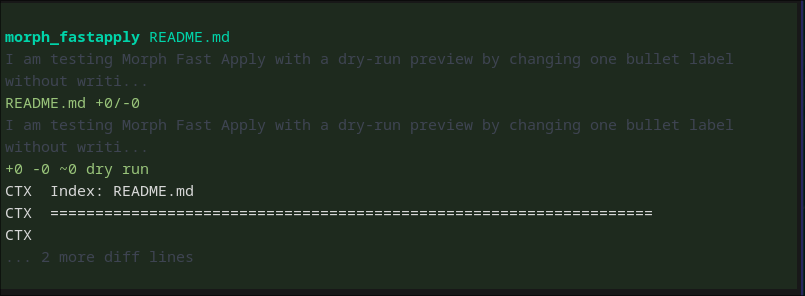

# pi-morphllm-plugin

Pi runtime extension package for Morph tools and compaction, with support for custom Morph base URLs and API endpoints.

Made by rickicode.

This package is intentionally not a thin skill-only package. It installs as a normal Pi package, then runs an active extension that registers Morph tools, commands, lifecycle hooks, and compaction behavior.

## Features

- `morph_fastapply` for Fast Apply style file merging with dry-run preview
- `warpgrep_codebase_search` for local exploratory code search
- `warpgrep_github_search` for public GitHub source lookup
- Morph compaction integration for large conversations
- `MORPH_BASE_URL` / `MORPH_BASE_API` override support
- Single-key and multiple-key Morph API configuration
- Prompt-level Morph-first routing guidance without blocking native Pi tools

## Install

### Install from npm

```bash
pi install npm:pi-morphllm-plugin
```

This is the main installation path and does not require cloning the repository.

### Try for the current run only

```bash
pi -e npm:pi-morphllm-plugin
```

This loads the package temporarily for the current Pi run without adding it to your installed package list.

### Local development

If you are working on the package itself, clone the repository and run:

```bash
pi -e .
```

This loads the package manifest from `package.json`, so Pi discovers both the Morph extension and the bundled prompt resource.

### Extension-only development shortcut

```bash
pi -e ./extensions/morph/index.js
```

Use the extension entrypoint directly only when you intentionally want to test the extension file by itself. That path does not load the package prompt resource from `prompts/morph-tools.md`.

## Editing Policy

Pi Morph uses guidance, not runtime blocking.

- Small exact replacements should use native `edit`.
- Brand new files should use native `write`.
- Large files, multi-location edits, and whitespace-sensitive merges should use `morph_fastapply`.
- If the model chooses a workable native tool anyway, the extension allows it and continues instead of blocking.

## Config

The easiest setup is a JSON file.

Pi Morph looks for config in this order:

- `MORPH_CONFIG` if you want to point at a custom JSON file
- `~/.pi/agent/morph.json` as the default global Pi config
- `.pi/morph.json` in the current project
- `morph.config.json` in the current project

The recommended setup is global package-style config in `~/.pi/agent/morph.json`.
Pi Morph auto-creates that global file on first runtime load when no existing Morph config is found.
Installing the package alone does not create the file; the extension must actually be loaded by Pi.

A repo example is available at `.pi/morph.json.example`.
You can also create the global config manually:

```bash
mkdir -p ~/.pi/agent
cp .pi/morph.json.example ~/.pi/agent/morph.json
```

### Single API key

Example config:

```json
{
  "apiKey": "sk-...",
  "baseUrl": "https://my-morph-proxy.example.com",
  "editEnabled": true,
  "warpgrepEnabled": true,
  "warpgrepGithubEnabled": true,
  "compactEnabled": true,
  "routing": {
    "editMode": "force",
    "codebaseSearchMode": "force",
    "githubSearchMode": "force",
    "fallbackToNativeTools": true,
    "forceMorphCompactCommand": true
  },
  "compactContextThreshold": 0.7,
  "compactPreserveRecent": 1,
  "compactRatio": 0.3,
  "timeoutMs": 30000,
  "warpGrepTimeoutMs": 60000,
  "compactTimeoutMs": 60000
}
```

### Multiple API keys

Pi Morph also supports key rotation across multiple Morph API keys.
Set `apiKey` to `"multiple"`, point `apiKeyFile` at a text file, and choose an `apiKeyStrategy`.

```json
{
  "apiKey": "multiple",
  "apiKeyFile": "~/.pi/agent/morph.txt",
  "apiKeyStrategy": "round-robin",
  "baseUrl": "https://api.morphllm.com"
}
```

Example `morph.txt`:

```txt
sk-key-1
sk-key-2
sk-key-3
```

Supported strategies:

- `round-robin` - rotate sequentially between configured keys
- `random` - choose a random configured key for each client call

The key file parser also ignores blank lines and `#` comments.
If a line contains pipe-delimited metadata like `name|label|sk-key`, Pi Morph uses the third field as the API key.

JSON values take precedence over environment variables.

Routing config lives inside `morph.json`:

- `routing.editMode` - `prefer`, `strong`, or `force` for prompt-level Morph-first edit guidance; default is `force`
- `routing.codebaseSearchMode` - `prefer`, `strong`, or `force` for prompt-level local WarpGrep guidance; default is `force`
- `routing.githubSearchMode` - `prefer`, `strong`, or `force` for prompt-level public GitHub WarpGrep guidance; default is `force`
- `routing.fallbackToNativeTools` - when `true`, Morph tool failures explicitly fall back to native Pi tools
- `routing.forceMorphCompactCommand` - when `true`, `/morph-compact` forces the Morph compaction path

Invalid routing mode strings automatically fall back to safe defaults:

- `routing.editMode` -> `force`
- `routing.codebaseSearchMode` -> `force`
- `routing.githubSearchMode` -> `force`

### Environment variable fallback

If you still want env-based setup, these keys are supported:

- `MORPH_API_KEY` - Morph API key, or `multiple` to enable file-based key rotation
- `MORPH_API_KEY_FILE` - optional path to a newline-delimited API key file for multi-key mode
- `MORPH_API_KEY_STRATEGY` - `round-robin` or `random` for multi-key selection
- `MORPH_BASE_URL` - optional custom Morph API base URL
- `MORPH_BASE_API` - optional alias for custom Morph API base URL
- `MORPH_EDIT` - set `false` to disable `morph_fastapply`
- `MORPH_WARPGREP` - set `false` to disable local WarpGrep
- `MORPH_WARPGREP_GITHUB` - set `false` to disable GitHub WarpGrep
- `MORPH_COMPACT` - set `false` to disable Morph compaction
- `MORPH_ALLOW_READONLY_AGENTS` - set `true` to allow `morph_fastapply` in readonly agents
- `MORPH_COMPACT_TOKEN_LIMIT` - optional fixed compaction trigger in tokens
- `MORPH_COMPACT_CONTEXT_THRESHOLD` - optional fraction of context window to trigger compaction
- `MORPH_COMPACT_PRESERVE_RECENT` - recent messages to keep uncompacted
- `MORPH_COMPACT_RATIO` - target compression ratio
- `MORPH_TIMEOUT` - optional Fast Apply timeout in ms
- `MORPH_WARPGREP_TIMEOUT` - optional WarpGrep timeout in ms
- `MORPH_COMPACT_TIMEOUT` - optional compaction timeout in ms

## Commands

- `/morph_status` shows the loaded config path, API key status, SDK status, base URL, feature flags, routing mode state, and whether Morph-first guidance is active.
- `/morph_settings` opens a simple interactive menu for updating routing settings in `morph.json`.
- `/morph-compact` follows `routing.forceMorphCompactCommand`: force Morph compaction when enabled, or run normal Pi compaction with Morph auto-compaction rules when disabled.

Example `/morph_status` fields:

- `Morph config: ~/.pi/agent/morph.json`
- `Morph API key: configured`
- `Morph API key source: single key`, `3 keys (round-robin)`, or `key file: ~/.pi/agent/morph.txt` depending on your configuration
- `Morph FastApply enabled: true`
- `Routing edit mode: force`
- `Routing codebase search mode: force`
- `Routing GitHub search mode: force`
- `Morph FastApply-first guidance active: true`
- `Morph-first local search guidance active: true`
- `Morph-first GitHub search guidance active: true`
- `Fallback to native tools: true`
- `Force /morph-compact: true`

`/morph_status` is the main summary view. Use `/morph_settings` when you want to change config interactively instead of editing JSON by hand. Reload the extension or session after credential or key-file changes so Morph clients are rebuilt with the new config. The footer also shows `MorphLLM` plus the loaded API key count, and includes the strategy when multiple keys are active.

## Tools

- `morph_fastapply` handles large or scattered edits in existing files using `// ... existing code ...` markers and supports `dry_run` previews.
- `warpgrep_codebase_search` answers exploratory questions about the current workspace.
- `warpgrep_github_search` searches public GitHub repositories without cloning them locally.
- Tool preference strength and fallback behavior are controlled by `routing` in `morph.json`.
- In `force` mode, the extension applies the strongest Morph-first guidance in prompts and tool descriptions, but native tools remain available.
- In `strong` mode, the extension strongly prefers Morph tools for suitable cases.
- In `prefer` mode, the extension gives a softer recommendation without changing tool availability.

Example `morph_fastapply` diff preview:



Example `morph_fastapply` preview call:

```json
{
  "target_filepath": "src/utils/math.ts",
  "instructions": "I am adding input validation to the add function.",
  "code_edit": "function add(a: number, b: number): number {\n  if (typeof a !== 'number' || typeof b !== 'number') {\n    throw new TypeError('Both arguments must be numbers.');\n  }\n  // ... existing code ...\n}",
  "dry_run": true
}
```

Use `dry_run: true` first when you want to inspect the diff preview without writing the file. Then rerun the same tool call with `dry_run: false` or omit it to apply the edit.

## Hooks And Compaction

This package uses Pi extension hooks rather than command aliases alone.

- `session_start` and `session_shutdown` manage Morph runtime status in the UI.
- `before_agent_start` injects Morph routing hints into the system prompt based on `routing` config.
- `tool_call` normalizes tool input before execution.
- `tool_result` adds Morph metadata such as provider and base URL.
- `model_select` tracks the active model context window.
- `session_before_compact` runs Morph compaction before Pi falls back to its normal compactor.
- `/morph-compact` either forces the Morph compaction path or follows normal threshold rules depending on `routing.forceMorphCompactCommand`.

## Development

Clone the repository only if you want to work on the package itself.

Copy `.pi/morph.json.example` to `.pi/morph.json` or create `~/.pi/agent/morph.json`, fill in `apiKey`, then run:

```bash
pi -e .
```

Useful development modes:

- `pi -e .` loads the full package manifest, extension, and bundled prompt resource.
- `pi -e ./extensions/morph/index.js` loads only the extension entrypoint.
- `npm test` runs the package tests.

## Notes

- Default Morph endpoint is `https://api.morphllm.com`.
- `MORPH_BASE_URL` takes precedence over the default endpoint.
- `MORPH_BASE_API` is supported as a compatibility alias.
- The package manifest in `package.json` allows Pi to auto-discover the extension and prompt resource.
- Automatic config creation happens on first runtime load, not during `pi install`.
- Automatic config creation only targets `MORPH_CONFIG` or the global `~/.pi/agent/morph.json` path, never a project-local file by default.

## Testing

Run:

```bash
npm test
```
